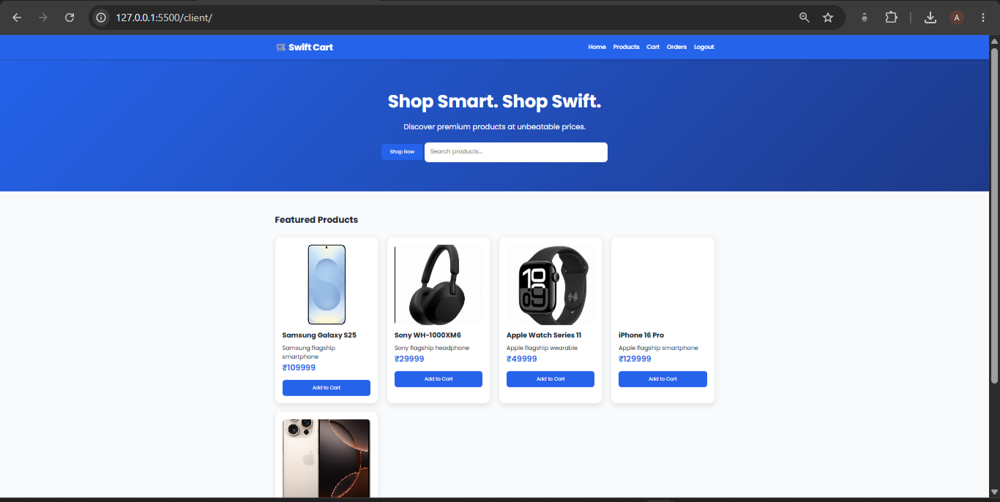
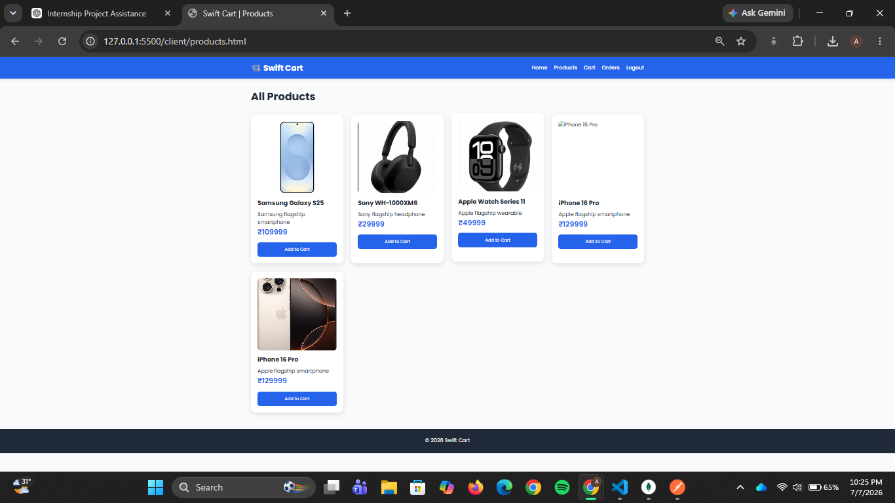
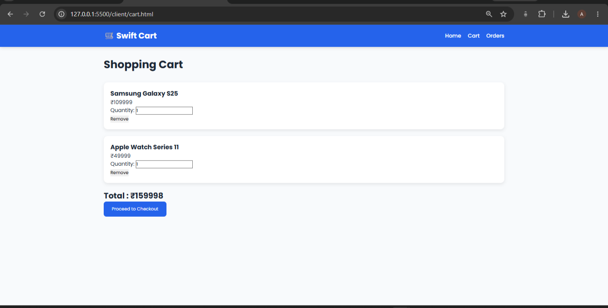
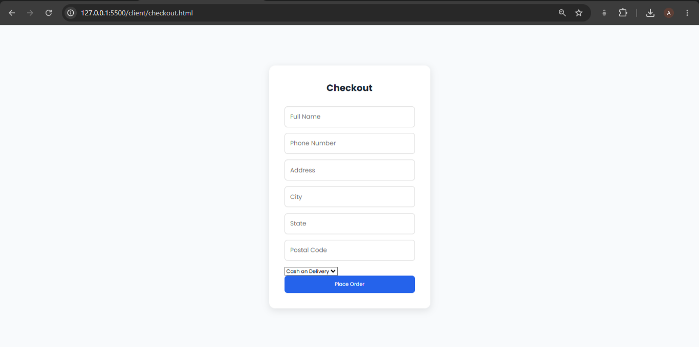
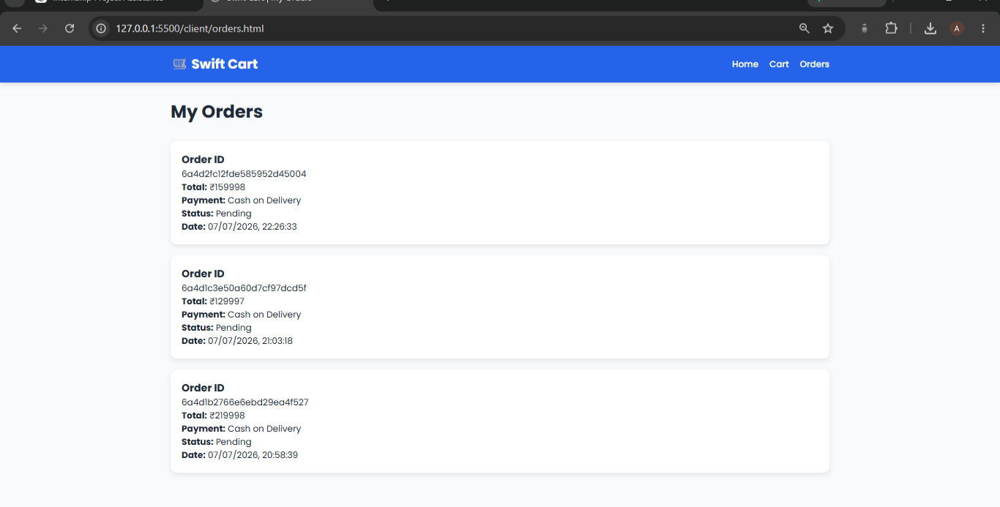
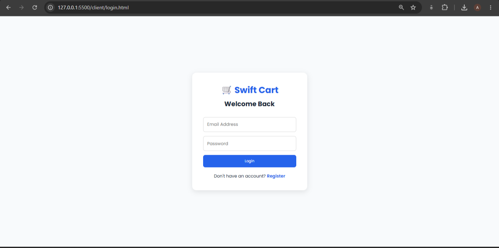
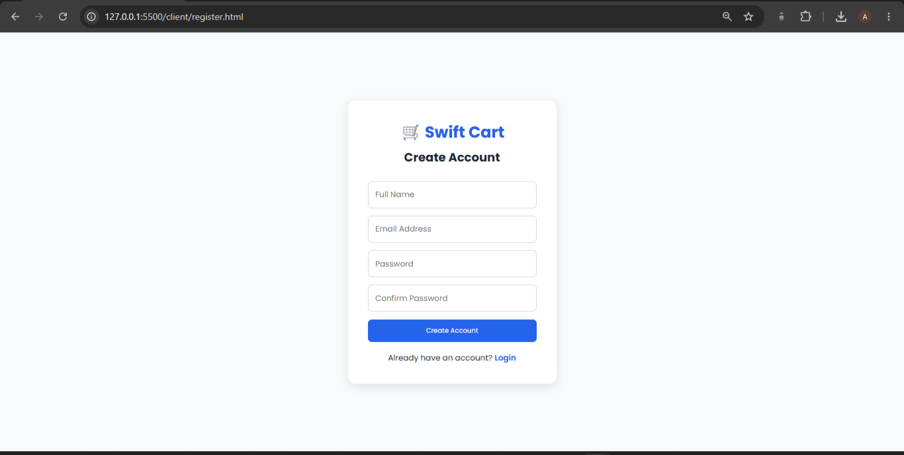

# 🛒 Swift Cart

**Swift Cart** is a Full Stack E-Commerce Web Application developed using HTML, CSS, JavaScript, Node.js, Express.js, MongoDB, and JWT Authentication.

The application allows users to browse products, add items to a shopping cart, place orders, and manage their purchases through a secure authentication system.

---

## 📌 Features

### User Features

- User Registration
- User Login using JWT Authentication
- Browse Products
- Add Products to Cart
- Update Cart Quantity
- Remove Products from Cart
- Checkout
- Place Orders
- View Order History

### Admin Features

- Add Products
- Update Products
- Delete Products
- Manage Orders
- Update Order Status
- Cancel Orders

---

## 🛠 Tech Stack

### Frontend

- HTML5
- CSS3
- JavaScript (Vanilla)

### Backend

- Node.js
- Express.js

### Database

- MongoDB
- Mongoose

### Authentication

- JSON Web Token (JWT)

---

## 📂 Project Structure

```
Swift-Cart
│
├── client
│   ├── assets
│   ├── css
│   ├── js
│   ├── index.html
│   ├── login.html
│   ├── register.html
│   ├── products.html
│   ├── cart.html
│   ├── checkout.html
│   └── orders.html
│
├── server
│   ├── config
│   ├── controllers
│   ├── middleware
│   ├── models
│   ├── routes
│   └── server.js
│
├── package.json
└── README.md
```

---

## ⚙️ Installation

### 1 Clone the repository

```bash
git clone https://github.com/AK177144/swift-cart.git
```

### 2 Navigate into the project

```bash
cd swift-cart
```

### 3 Install backend dependencies

```bash
npm install
```

### 4 Create a `.env` file

```
PORT=5000

MONGO_URI=mongodb://127.0.0.1:27017/ecommerce

JWT_SECRET=your_secret_key
```

### 5 Start MongoDB

Ensure MongoDB is running locally.

### 6 Start the backend

```bash
npm run dev
```

### 7 Launch the frontend

Open the `client` folder using **Live Server** in Visual Studio Code.

---

## 📷 Application Screenshots

### 🏠 Home Page




### 📦 Products Page




### 🛒 Shopping Cart




### 💳 Checkout Page




### 📋 My Orders




### 🔐 Login Page




### 📝 Register Page



---

## 🚀 Future Enhancements

- Product Search
- Product Categories
- Wishlist
- Online Payment Gateway
- Product Reviews
- Responsive Admin Dashboard
- Dark Mode

---

## 👨‍💻 Author

**Anandu K**

Computer Science Engineering Student

---

## 📄 License

This project was developed for educational and internship purposes.